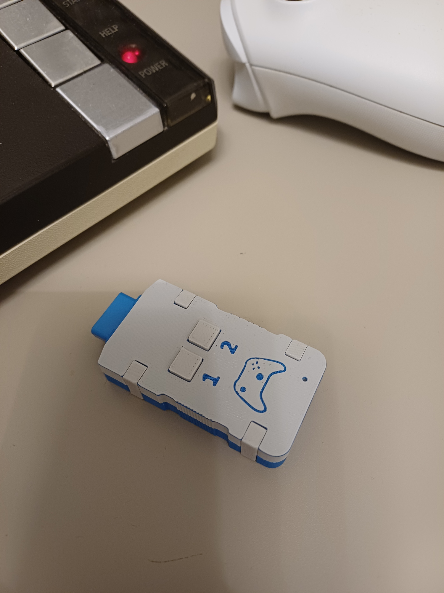
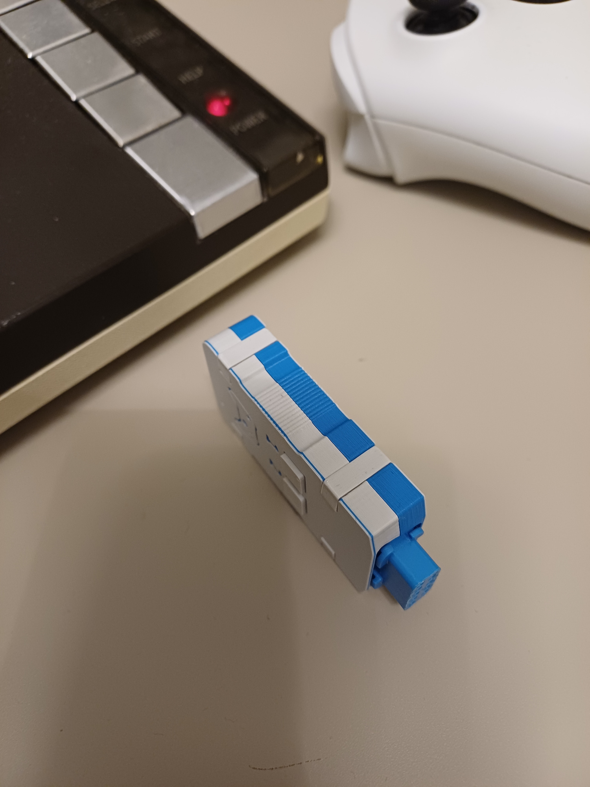
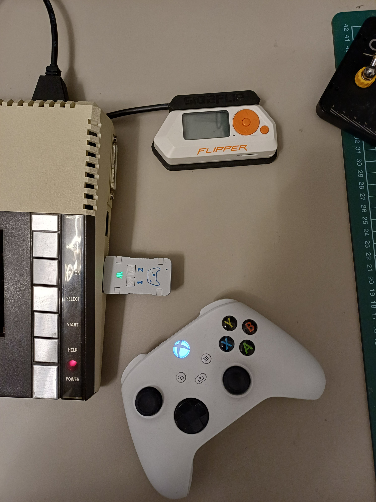

# 🕹️ Blue2Joy

**Blue2Joy** is an adapter that lets you use modern Bluetooth controllers with Atari 8-bit computers. It emulates **digital joysticks**, **analog paddles**, and supports **bidirectional communication** and much more.

While primarily intended for gamepads, the device is not limited to them - in principle, any BLE HID device, such as a keyboard or mouse, can be connected.

> Only devices that fully support the BLE HID over GATT Profile (HOGP) are supported. For this reason many older devices (especially gamepads) are unfortunately are not usable with Blue2Joy. See [compatible devices](/doc/compatible-devices.md).
>
> I was not aware of this limitation at the beginning of the project. Had I known, I might have chosen a different approach or possibly not started the project at all. Even so, working on this project has been enjoyable and highly educational, and I learned a great deal in the process. I am also considering a future hardware revision that would either support Bluetooth Classic devices or implement a USB host interface, which could remove some of the current limitations. Despite these issues, I ultimately decided to publish the project, as I see future potential in it and believe it may still be useful or inspiring to others.

  
  
  
  

Have a look at the potentiometer emulation demo:

## Use Cases
While there are other adapters that let Bluetooth controllers act as digital joysticks, Blue2Joy goes further. Besides standard and expected use cases, there are a few new possible ones that utilize analog input emulation or bidirectional communication:

- Use a gamepad as a digital joystick with up to 3 buttons (Joy2B+ standard)
- Use gamepad analog sticks as paddles (direct or integration mode)
- Emulate paddles with a mouse
- Use a gamepad as an analog joystick (two axes on analog inputs) with up to 5 buttons
- Connect a mouse digitally - using quadrature encoding as on the Atari ST
- Connect a mouse in an analog way - using analog inputs for deltas, with up to 5 buttons
- Configure Blue2Joy via SPI-like communication over the joystick port
- Emulate the Y-axis of a light pen (conceptual idea, not sure if possible)
- Emulate an XEP-80 terminal (feasible in principle, but not started yet)

Although designed for Atari 8-bit systems, Blue2Joy can be used with any device that follows the same joystick port pinout - with paddle functionality available only on Atari computers (see [details](/doc/paddle-emulation.md)).

## 🚧 Project Status

Blue2Joy is currently under active (but really slow) development. The hardware is stable and most of core features have been successfully tested, but the software still needs needs some work to reach the level of polish I would consider complete.

## Repository Structure

This repository contains complete project documentation and source code for all Blue2Joy components shown in the following image.

### Blue2Joy Hardware
- Nordic nRF52840 (Cortex-M4F @ 64 MHz) with integrated Bluetooth 5 LE radio
- USB 2.0 Full-Speed (device mode only) for firmware updates and debugging
- Female 9-pin D-sub connector
- RGB LED used as a status indicator (see [details](/doc/state-signalling.md))
- Two user push-buttons (see [details](/doc/button-functions.md))

For more details, see the [hardware](/hardware/) folder.

### Blue2Joy Firmware
- Supports pairing and connection to BLE HID devices (tested with Xbox Wireless Controller)
- Emulates a joystick port digital inputs as well as analog paddle potentiometers
- Supports bidirectional (SPI) communication with the Atari
- Indicates device status with an RGB LED
- Allows custom mapping of HID-device controls to joystick and paddle inputs

For more details, see the [firmware](/firmware/) folder.

### Web Configuration
- A web application that allows to configure Blue2Joy device directly from any browser supporting the Web Bluetooth standard
- Provides an easy way to configure the mapping of HID controls to joystick port digital and analog pins
- Configure the device even while it is connected to HID devices (e.g., gamepads, mice)

The application is available at https://cepetr.github.io/blue2joy/main.

For more details, see the [webconfig](/webconfig/) folder.

### Atari Application
- Not implemented yet. This component currently exists only as a design intention.
- Intended to be an application that allows configuring the Blue2Joy device directly from Atari
- Planned to use the bidirectional (SPI-like) communication over the joystick port

For more details, see the [atari](/atari/) folder.

## Feedback & Contributions

I'd be very happy to receive any feedback, pull requests, or even just a note that you've built and tried out Blue2Joy.

## License

This repository contains software, firmware, and hardware design files.

### Software and Firmware

All software and firmware files (in `atari/`, `firmware/` and `webconfig/`) are licensed under the GNU General Public License, version 3.

See [LICENSE-GPL](LICENSE-GPL) for details.

### Hardware

Schematics, PCB, Mechanical design files (in `hardware/`) are licensed under the CERN Open Hardware Licence Version 2 - Strongly Reciprocal. You are free to use, modify, and share them, but if you distribute hardware or modified design files, you must also share your changes under the same license.

See [LICENSE-CERN](LICENSE-CERN) for details.

