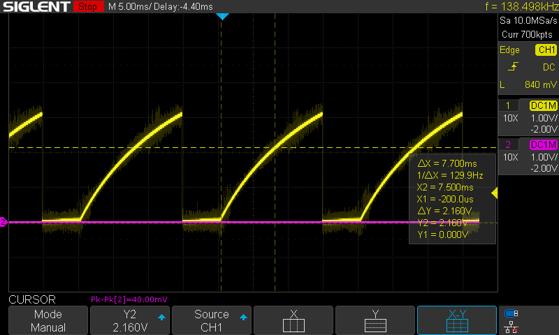
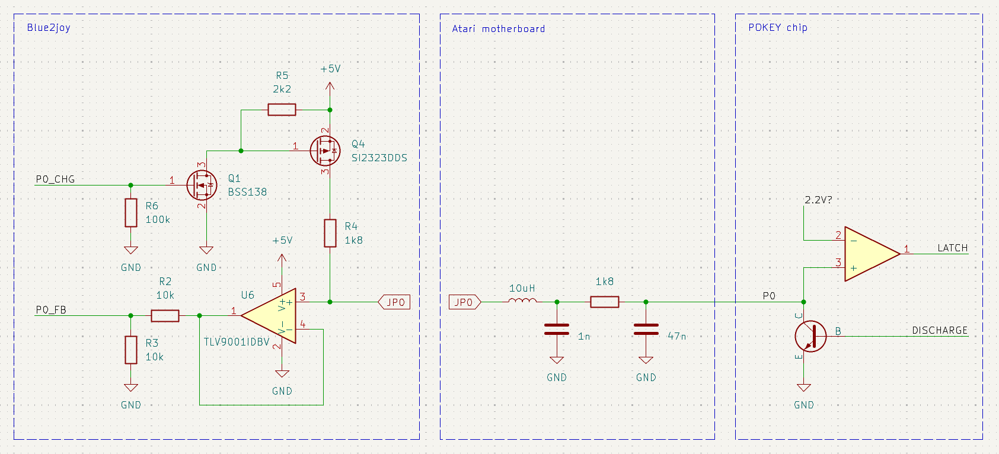
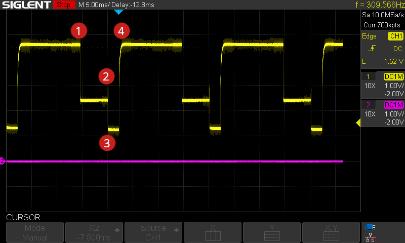
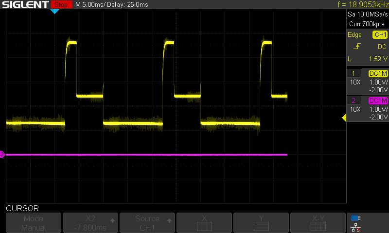

# How paddle input works

Paddle controllers use 1 MΩ potentiometers to charge an RC network (1.8 kΩ, 47 nF) located inside the 8-bit Atari system. This network is connected to the POTx inputs of the POKEY chip. The POKEY chip contains discharge (dump) transistors, eight 8-bit latches, and a binary counter that counts up to 228, driven by ~16kHz clock signal⏱️.

The measurement cycle begins when the CPU writes to the `POTGO` register. This action:
- resets the counter,
- starts it counting,
- releases the dump transistors, allowing the external capacitors to charge through the paddle potentiometers.

As each POTx input reaches a logical high level, the current counter value is latched into the corresponding POTx register, where it can later be read by the CPU.

If the counter reaches 228, regardless of whether a logical high is detected on a POTx input, it:

- stops,
- re-engages the dump transistors,
- discharges the capacitors.

POTx acquisition and writing to the `POTGO`register are handled in the VBI interrupt handler at 50/60 Hz.

The following pictures show the voltage on the paddle input (on the joystick port) for two different resistances:

| 27kΩ (POT0=13) | 270kΩ (POT0=121) |
|----------|-------------|
|  |  |

# How paddle emulation works

This design uses neither an analog nor a digital potentiometer. Instead, it relies on precise timing: 5 V is applied to the paddle input exactly when the 47 nF capacitor must be charged. Achieving this requires detecting the precise instant the POKEY chip turns off its discharge transistor and starts a new measurement cycle.

Detecting the moment the transistor engages (when the capacitor is forced to ground) would be easier, but it provides little value—we still would not know when the VBI handler writes to POTGO, so we could not time the charge pulse accurately.

To sense the transistor’s release, we bias the paddle input through a 1.8 kΩ resistor with 5 V. While the discharge transistor is active, the pin settles at ~2.5 V. As soon as POKEY releases the transistor, the voltage on POTx rises rapidly. This transition must be detected within a few microseconds, and the bias must be removed immediately so the capacitor is not prematurely charged past the logic-high threshold.

Once the release is detected, we can schedule a precisely calibrated delay before re-applying 5 V to the POTx pin to drive the capacitor to 5 V in one shot. The delay is quantized in 64 µs increments (1/16kHz), directly corresponding to the current count value of POKEY’s internal counter.

Because all timing is handled entirely in hardware - without any CPU intervention - the result is highly precise and introduces minimal jitter. To achieve this, we utilize one on-chip comparator with a 64-level selectable threshold, one hardware timer per POTx input, GPIOTE for charge control, and PPI to interconnect these peripherals into a tightly synchronized system.

❷ **Trigger:** When the POKEY chip releases its discharge transistor, the on-chip comparator (COMP) detects the capacitor voltage crossing approximately 1.4 V and generates a single `COMP_UP` event.

❸ **Synchronise:** The `COMP_UP` event is routed via PPI to both `TIMER2.CLEAR` (1 MHz, 16-bit) and `GPIOTE_CLR(POT0)`. This marks the zero-time reference for the scan and ensures that the capacitor is no longer being actively charged.

❸-❹ **Time-shift:** A value written by software to `TIMER2.CCx`, calculated as 64 µs × v (where v = 1..228), defines the precise delay corresponding to the desired POKEY counter value.

❹-❶ **Drive caps:** When a `CCx` compare match occurs, PPI triggers `GPIOTE_SET(POT0)`, briefly enabling a P-MOSFET to apply 5 V to the paddle input. This action synthesizes the RC charge delay that POKEY measures. The 5 V level is held on the POTx line until the next scan cycle to allow detection of the next discharge-release event by the comparator.

🔗 Since all POKEY POTx inputs are sampled synchronously, the timing for POT1 channel is derived from the measurement on POT0.

The following pictures show the voltage on the paddle input (on the joystick port) for two different timer compare register values, emulating two different POT0 values:

| POT0=32 | POT0=192 |
|----------|-------------|
|  |  |

## ⚠️ Limitations

The proposed control method, along with the current circuit (with the 1.8 kΩ resistor in place), slightly limits the minimum time in which the capacitor can be charged. As a result, it is currently not possible to emulate all values in the 1-228 range, only 2-228. This could probably be addressed somehow, but at the moment I don't consider it critical.