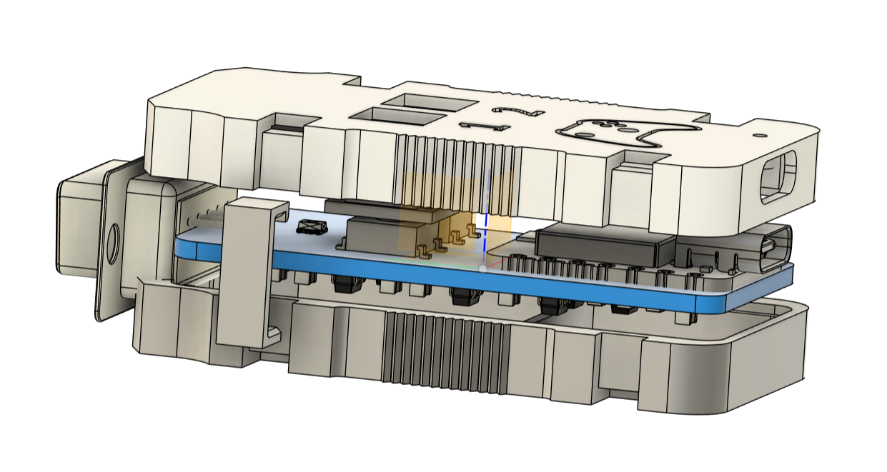
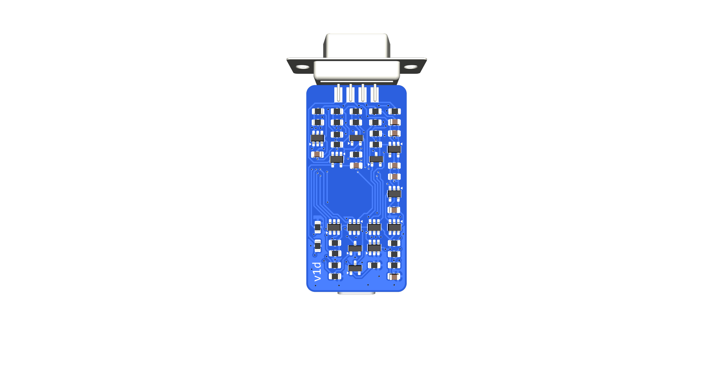
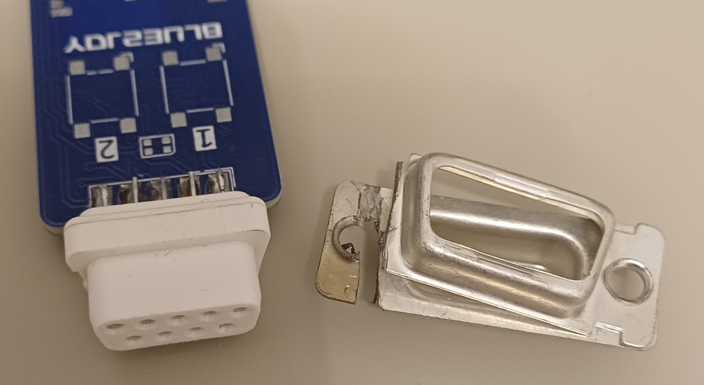

# 🔧 Blue2Joy — hardware

This folder contains the **KiCad** project and 3D design files for the Blue2Joy adapter:

* [`electronics/`](/hardware/electronics/) - KiCad project
* [`mechanical/`](/hardware/mechanical/) - 3-D model of the device’s enclosure

## Schematic & BOM

The design uses readily available SMD components and a XIAO nRF52840 module to keep the total cost and assembly complexity relatively low.

Schematic in PDF format is available [here](/hardware/electronics/fab_v1e/blue2joy-v1e.pdf)

The estimated parts cost is roughly USD 25, depending on the supplier and any volume discounts.

| # | Qty| Reference | Package |Part Numbers |
|----|---|-----------|---------|--------------------|
| 1  | 1 | U1 | | XIAO nRF52840 Plus |
| 2  | 1 | U2 | SOT-23-5 | TPS73133DBV |
| 3  | 2 | U3, U5 | SOT-23-6 | 74LVC2G17DBV |
| 4  | 3 | U4, U7, U8 | SOT-23-6 | 74LVC2G07DBV |
| 5  | 1 | U6 | SOT-23-5 | TLV9001IDBV |
| 6  | 1 | U9 | SOT-23-5 | XC8110AA01MR |
| 7  | 1 | U10 | SOT-23-6 | 74HCT2G34GV |
| 8  | 2 | Q1, Q3 | SOT-23-3 | BSS138 |
| 9  | 2 | Q4, Q5 | SOT-23-3 | SI2323DDS |
| 10 | 1 | J1 | - | DE9 Socket (Male)  |
| 11 | 2 | SW1, SW2 | - | OMRON B3FS-1010 |
| 12 | 1 | D1 | 2020 | WS2812-2020 |
| 13 | 8 | R1, R2, R3, R13, R14, R15, R18, R19 | 0805 | 10kΩ/125mW |
| 14 | 2 | R6, R10 | 0805 | 100kΩ/125mW |
| 15 | 4 | R8, R9, R11, R12 | 0805 | 18kΩ/125mW |
| 16 | 5 | R20, R21, R22, R23, R24 | 0805 | 820Ω/125mW |
| 17 | 2 | R4, R17 | 0805 | 1.8kΩ/125mW |
| 18 | 2 | R5, R16 | 0805 | 2.2kΩ/125mW |
| 19 | 4 | C1, C2, C3, C4 | 0805 | 1µF |
| 20 | 1 | C5 | 0805 | 10µF |
| 21 | 3 | C6, C7, C8 | 0805 | 100nF |

## PCB

The [`electronics/fab_v1d`](/hardware/electronics/fab_v1d/) folder contains the manufacturing files for the latest PCB revision.

## Assembly notes

Building the board **does require basic SMT soldering skills**.
If you have never worked with solder paste or hot air before, expect a small learning curve - nothing close to rocket science, but still a step up from through-hole work.

| Part type | Package | Difficulty (subjective) |
|-----------|---------|------------|
| Passives  | **0805** | easy; forgiving |
| Logic & power | **SOT-23-x** | fine for hot-air or drag solder, **be extra careful with orientation - SOT-23-6 parts have a tiny, barely visible dot marking pin 1** |
| MCU module | **XIAO nRF52840 Plus** (castellated) | can be hand-soldered with a fine-tip iron |
| RGB LED | **WS2812C-Mini** | the smallest part; watch orientation |

After assembly, verify that there are no shorts between pins on the SOT-23-x packages.

## DE9 Socket

DE9 (Cannon) connectors are manufactured only with a metal housing. After cutting along the edge, the plastic part can be popped out like a nut. However, the plastic parts differ between manufacturers, and in some cases, they need to be glued together.

## Hardware Status & Disclaimer

The PCB has been fabricated and tested on a single Atari 800XL. Hidden design flaws may still exist. Use all design files, instructions, and the board at your own risk; no warranties or guarantees are implied.

The plastic parts were printed from PLA (with 30% infill) on a Prusa Mk3 printer. The tolerances are quite tight, so it’s likely that on a different printer or with another material, there may be issues fitting the parts together.
